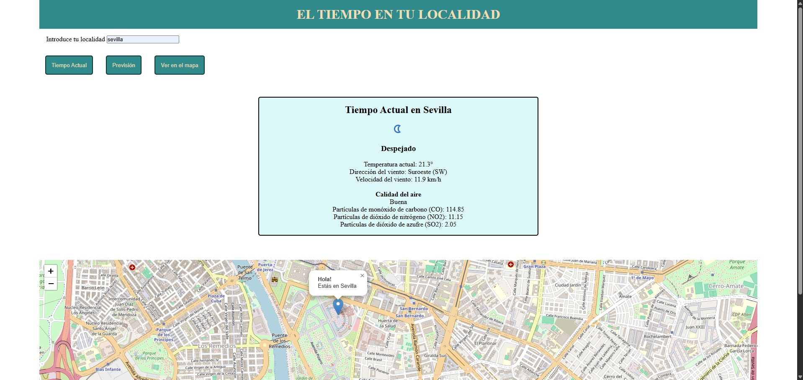
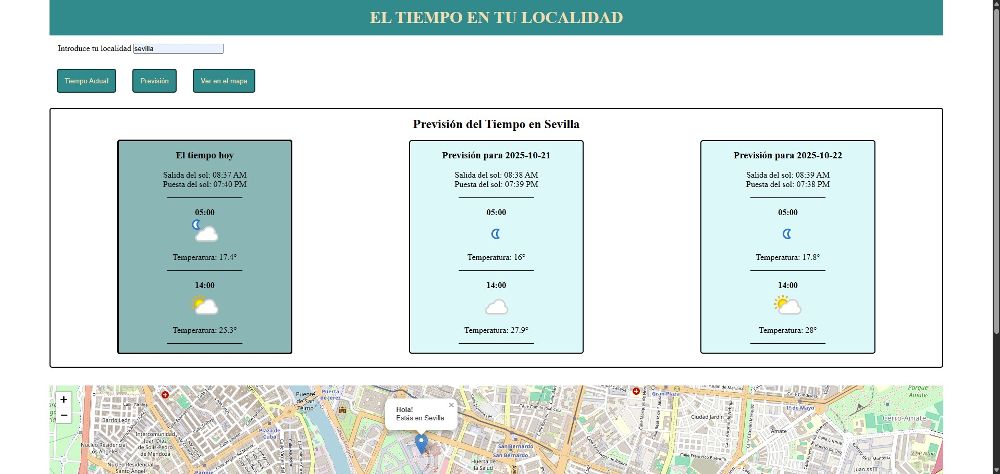
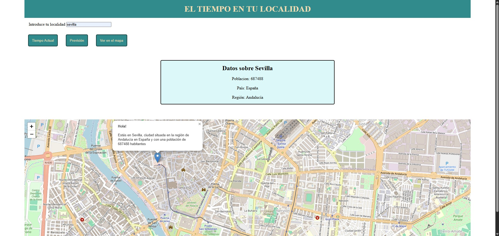

# ciudad-clima-ubicación

## Descripción
Proyecto desarrollado en **JavaScript** que permite consultar el **pronóstico del tiempo en tiempo real** y visualizar la **ubicación de una localidad en un mapa interactivo con Leaflet**, consumiendo datos de la **API de WeatherAPI** mediante **Axios, AJAX y Fetch**.

## 🚀 Funcionalidades
- Consulta del clima actual y previsión del tiempo de cualquier ciudad.
- Visualización de la ubicación de la ciudad en un **mapa interactivo** con Leaflet.
- Implementación de tres métodos diferentes para consumir la API: **Axios**, **AJAX** y **Fetch**.

## Notas

- El proyecto es una tarea de la asignatura "Desarrollo web en entorno cliente" y está pensando para practicar el consumo de APIs REST con distintos métodos (AJAX, Axios, Fetch) y la integración de mapas interactivos con Leaflet.
- La API key debe ser obtenida de [WeatherAPI](https://www.weatherapi.com/) y colocada en tu archivo local config.js.

---
## ⚙️ Configuración para probar el proyecto

1. Clona el repositorio:
```bash
git clone https://github.com/tu-usuario/ciudad-clima-ubicacion.git
```
2. Accede a la carpeta del proyecto y crea tu archivo config.js a partir del ejemplo:
```bash
cd ciudad-clima-ubicacion
cp js/config.js.example js/config.js
```
4. Abre js/config.js y reemplaza 'AQUI_TU_API_KEY' por tu propia API key de WeatherAPI:
```js
const APIKEY = 'AQUI_TU_API_KEY';
```
5. Abre index.html en tu navegador para probar la aplicación localmente.

## Capturas de pantalla



